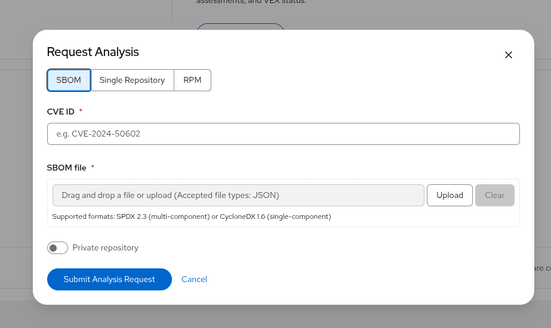
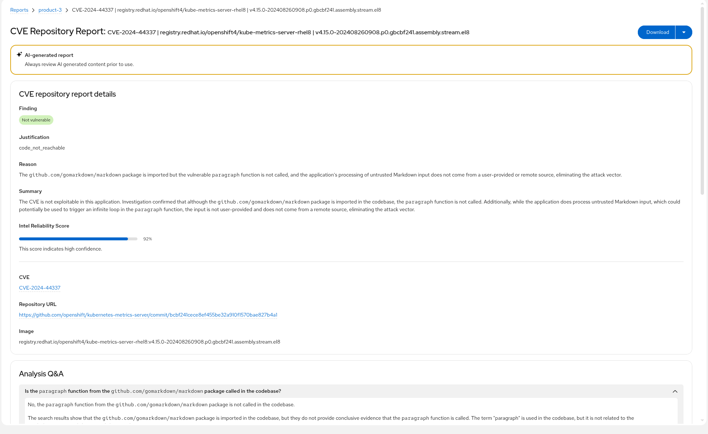
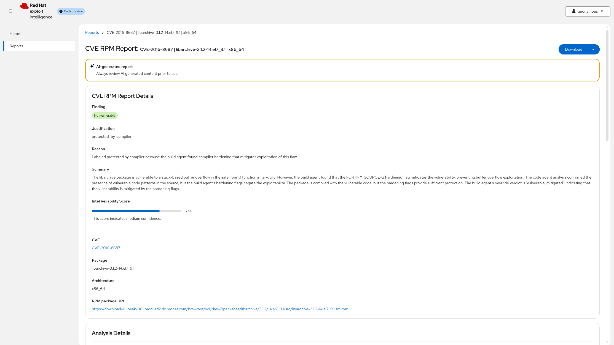
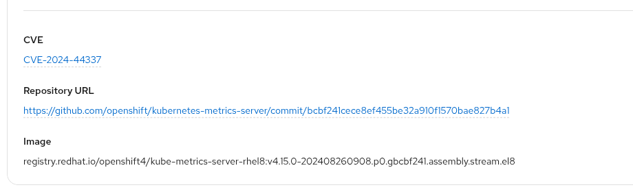
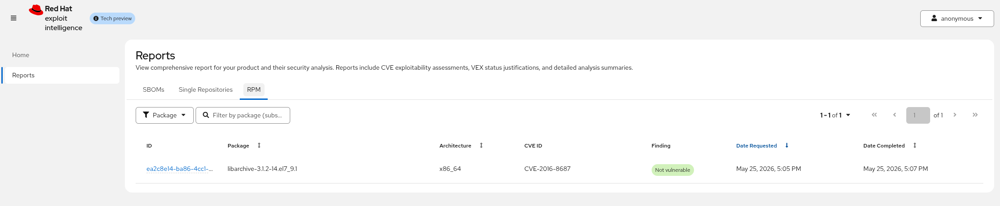
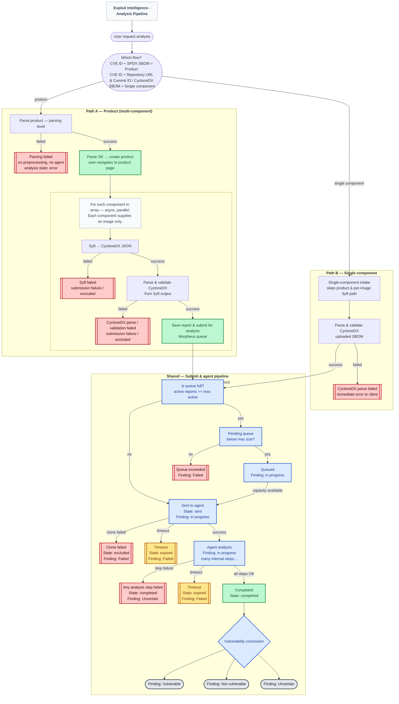

<!--
SPDX-FileCopyrightText: Copyright (c) 2026, Red Hat Inc. & AFFILIATES. All rights reserved.
SPDX-License-Identifier: Apache-2.0
Licensed under the Apache License, Version 2.0 (the "License");
you may not use this file except in compliance with the License.
You may obtain a copy of the License at
http://www.apache.org/licenses/LICENSE-2.0
Unless required by applicable law or agreed to in writing, software
distributed under the License is distributed on an "AS IS" BASIS,
WITHOUT WARRANTIES OR CONDITIONS OF ANY KIND, either express or implied.
See the License for the specific language governing permissions and
limitations under the License.
-->

# Red Hat Exploit Intelligence- client

This project is a Quarkus + React web application implemented to interact with ExploitIQ service
for sending requests to evaluate vulnerabilities on specific SBOMs.

For product documentation and deeper context, see the [Exploit Intelligence documentation](https://github.com/RHEcosystemAppEng/exploitiq-docs).

## Development

Check this other documents for:

* [Configuration](./docs/configuration.md)
* [Development](./docs/development.md)
* [SBOM Requirements](./docs/sbom-requirements.md) — SPDX 2.3 structure, OCI image labels, and example fixtures
* [Tests](./src/test/README.md) — REST `@QuarkusTest` notes and CI test image for pipelines

## Using the Application

Open http://localhost:8080/

### Home Page

On the Home page, you will find a central dashboard designed to manage your exploitability analysis workflow and monitor recent system performance.

**Get Started with ExploitIQ**

In this section, you will find quick-access links to the core functions of the application: Request Analysis, View Reports, and Learn More.

**Last Week Metrics**

In this section, you will find a summary of system performance from the past seven days.

### Request Analysis

The _Request Analysis_ dialog lets you choose an input type with **SBOM**, **Single Repository**, or **RPM**, then enter a CVE ID to analyze.

- **SBOM:** Upload a JSON SBOM file. Supported formats: **SPDX 2.3** and **CycloneDX 1.6** JSON. Refer to [SBOM Requirements](./docs/sbom-requirements.md) for details on expected SBOM structure.
- **Single Repository:** Provide a source repository URL and a commit ID instead of an SBOM file. Expand **Advanced** (optional) to set a **Manifest path** within the repo or a **Programming language** (`go`, `python`, `javascript`, `java`, or `c`); leave both blank to let the agent autodetect.
- **RPM:** Provide the package as a hyphen-separated **name-version-release** (N-V-R), for example `openssl-3.0.7-5.el9`, and select an architecture.

For private repositories, enable **Private repository** and enter an **Authentication secret** (SSH private key or Personal Access Token; the form auto-detects the type).

 The `user name` will be automatically added as a metadata parameter.

Once you have filled in the required fields for your chosen mode (SBOM file, repository and commit, or RPM package and architecture) and the CVE ID, you will be able to submit the request

After submitting the request, you will be redirected to the Report page. Once the analysis is complete, you will find a detailed report featuring the Agent's results for your request along with additional data insights.

- **Direct Links:** For repository-based analyses, the _Repository Name_ links directly to the git repository, while the _Commit ID_ links to the specific commit used in the analysis. For **RPM** requests, the report shows the package N-V-R, architecture, and an RPM package URL instead of repository details.

An example RPM report detail page:

**Note:** There is a configurable pool of concurrent requests. Any request that is submitted when the pool is full will be queued. If after a certain time a callback response is not received, the report will be _expired_ (failed).

### CVE Details Page

By clicking on the CVE link:

you will navigate to the CVE Details page where you can find details about a specific CVE.

### Reports Page

The Reports area is split into three tabs: **SBOMs**, **Single Repositories**, and **RPM**. Use the tab that matches how the analysis was submitted to browse, sort, filter, and open results for each report type.

**Report Organization:** Each row represents a report for that tab’s context (SBOM-based products, single-repository analyses, or RPM package checks), which may reflect one component or many depending on the original request.

You will be able to sort, filter, and organize the reports table to quickly locate specific data.

After clicking a _ID_ link, you will find one of two views depending on the request type:

- **Single Component:** You will be taken directly to the detailed report page as described above.

- **Multiple Components:** You will be directed to an SBOM overview page that provides a high-level summary of results across all components.

### Report Page

On this page, you will find:

- **Report Details:** You will see general information about the report, including _overview statuses_ such as Repository Analysis Distribution and a CVE Status Summary, which provide high-level data on the SBOM and its associated CVEs.
 When there are excluded components, the **Excluded components** field links to a dedicated page that lists component name, package URL, and error for each item that was left out of analysis.

- **Component Table:** Below the summary data, you will find a table listing all components included in the SBOM:

You will be able to sort, filter, and organize the reports to quickly locate specific data.

- **ID link:** Finally, By clicking the _ID_ link, you will be taken to the detailed report page for that specific repository, the same page you would access directly for a single-component SBOM.

### Excluded Components Page

For multi-component SBOM reports, some components may fail before analysis starts (for example during Syft SBOM generation or metadata validation). On the SBOM overview **Report** page, when any components were excluded, the **Excluded components** link opens a table of those failures: **Component**, **Package URL**, and **Error**. Use this page to see why specific images or packages were not analyzed and what to fix in the SBOM or image metadata.

### Report

### Download Feature

A blue **Download** button is available on the repository report page, providing access to download either the VEX (Vulnerability Exploitability eXchange) data or the complete report as JSON files. The VEX option is only available when the component is in a vulnerable status and is automatically disabled otherwise.

## Analysis pipeline diagram

The flowchart below is a high-level map of what happens after you submit an analysis request. It is meant for operators, integrators, and anyone tracing why a report ended up **queued**, **sent**, **failed**, **excluded**, or in a given **finding** state.

The diagram is rendered here for GitHub readers. To iterate on layout or wording, edit [docs/analysis-pipeline-workflow.mmd](./docs/analysis-pipeline-workflow.mmd) and paste the updated `flowchart` (and `%%{init: ...}%%` line if present) into the block below.

